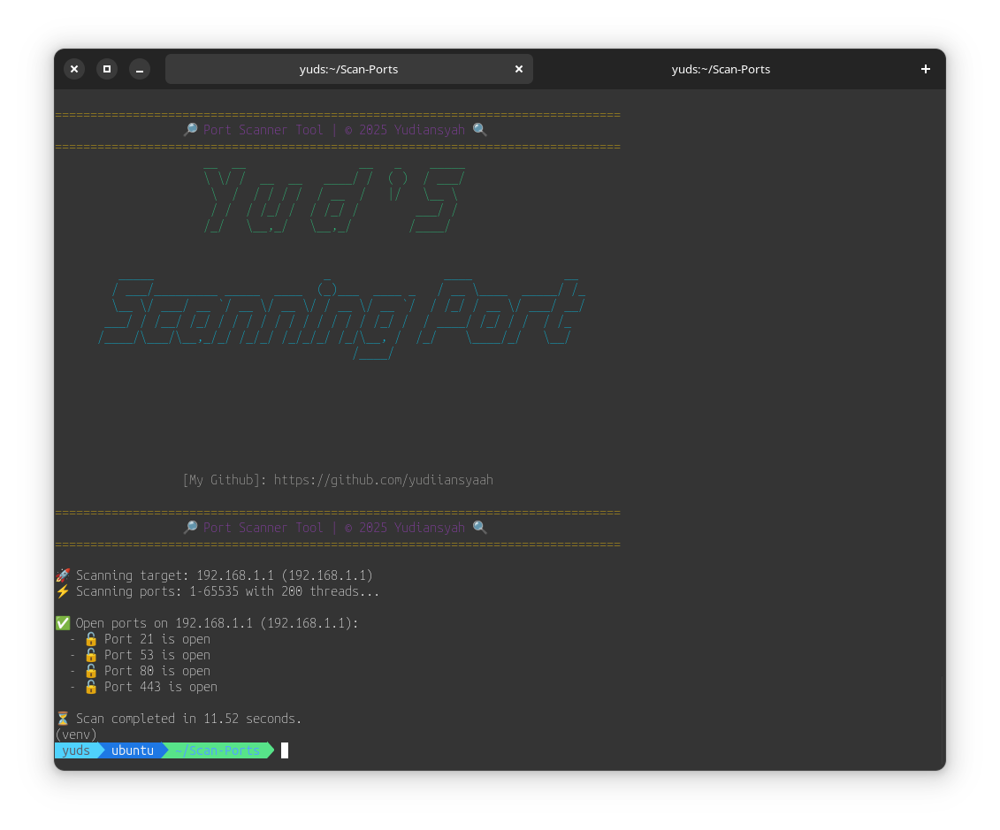

# 🔍 Yud'S Port Scanner




An advanced **Python-based Port Scanner** that allows you to scan open ports on a target IP address quickly and efficiently using **multi-threading**.

## 🚀 Features
✅ Scan specific ports (e.g., `22, 80, 443`).  
✅ Scan a range of ports (e.g., `1-1000`).  
✅ Scan all ports (`1-65535`).  
✅ Multi-threading for faster scanning.  
✅ Automatically asks for target IP if not provided.  

---

## 📌 Installation

Make sure you have Python installed on your system. Then, clone the repository and install the required dependencies:

```bash
# Clone the repository
git clone https://github.com/yudiiansyaah/port-scanner.git

# Change to the project directory
cd port-scanner

# Install venv (Linux/macOS/Windwos)
sudo apt install python3-venv  # Linux (Debian/Ubuntu, Kali Linux)
sudo pacman -S python3-venv    # Arch Linux
sudo dnf install python3-venv  # Fedora
sudo zypper in python3-venv    # openSUSE

# macOS
brew install python3-venv      # macOS

# Windows
pip install virtual venv

# Linux/macOS/Windows
python3 -m venv venv # Linux/macOS
python -m venv venv  # Windows

# Activate venv
source /venv/bin/activate  # Linux/macOS
venv\Scripts/activate      # Windows

# Install dependencies
pip install -r requirements.txt
```

## ⚡ Usage
1️⃣ Scan a specific IP and port(s)
```
python3 main.py 192.168.1.1 -p 22,80,443
```
🔹 Description: Scans ports 22, 80, and 443 on the target IP.

2️⃣ Scan a range of ports
```
python3 main.py 192.168.1.1 -p 1-1000
```
🔹 Description: Scans all ports from 1 to 1000.

3️⃣ Scan all ports (default behavior)
```
python3 main.py 192.168.1.1
```
🔹 Description: Scans all ports (1-65535) on the target.

4️⃣ Use multi-threading for faster scanning
```
python3 main.py 192.168.1.1 -t 200
```
🔹 Description: Uses 200 threads to speed up the scan.

🎯 Example Output
```
🔍 Please enter the target IP address: 192.168.1.1

🚀 Scanning target: 192.168.1.1
⚡ Scanning ports: 1-1000 with 100 threads...

✅ Open ports on 192.168.1.1:
  - 🔓 Port 22 is open
  - 🔓 Port 80 is open

⏳ Scan completed in 3.45 seconds.

```

## 📜 License
This project is licensed under the [MIT License](License)

## 👤 Author
Yudiansyah
- 📌 Instagram:  [yudiiansyaah](https://instagram.com/yudiiansyaah)
- 📌 X/Twiiter:  [yudiiansyaah](https://x.com/yudiiansyaah)
- 📌 GitHub: [yudiiansyaah](https://github.com/yudiiansyaah)
- 📌 Email:  [email](411221035@mahasiswa.undira.ac.id)

## ⭐ Support & Contributions
💡 Found a bug or want to improve the project? Feel free to submit an issue or pull request!
If you like this project, don't forget to give it a star ⭐ on GitHub!
